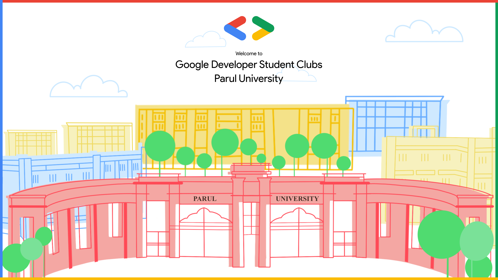

# Hi there 👋

## 💡 About
Google developer student club was started as an initiative by google to help students bridge gap between theory and practice through various technical events.

The club has had a great impact on students worldwide so what are you waiting for!
Come [join us](https://gdsc.community.dev/parul-university-vadodara/) :
- 💗 Connect and collaborate
- 👥 Gain new skills through hand-on training, workshops, events, talks and much more!
- 🧑‍💻 Apply new learning to build solutions for local problems

> 🚀 We are now a growing community of creative developers who are passionate about learning new technologies, building💡 meaningful projects and get access to google developer resources and opportunities for free.

## Open-Source 
- 📘 [Code of Conduct](https://github.com/GDSCParulUniversity/.github/blob/main/CODE_OF_CONDUCT.md)
- 📙 Contribution Guidelines (✌️ **coming soon** )
- 🌍 [how to contribute to OpenSource](https://opensource.guide/)
<!-- - ⚙️ Current projects [for later] -->

    <a target=”_blank” href="https://www.instagram.com/gdsc_pu/"><u>Instagram</u></a>
    | <a target=”_blank” href="https://discord.gg/Ar8H3RhqQ4"><u>Discord</u></a>
    | <a target=”_blank” href="https://www.youtube.com/channel/UCyORBFDGPvUU0hPL2PRaxsg"> <u>YouTube</u></a>
    | <a target=”_blank” href="https://www.linkedin.com/company/dscpu/"><u>LinkedIn</u></a>

